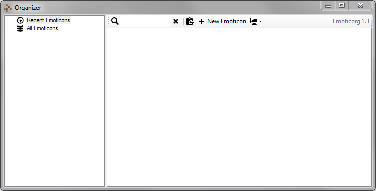

#  Emoticorg

Emoticorg is an emoticon organizer. Use it to organize images, GIFs, text emoticons.

By default, it creates a data file in %APPDATA%\Emoticorg\store.sqlite



## Requirements

Currently, Emoticorg only supports Windows (32bit software, will run on 64bit as well.) due to the used SQLite library. Other than that, it is compatible with other platforms via Mono. Status of the implementation is tracked in issue #19.

## Building a Release Version

Emoticorg contains an MSBuild Project (Emoticorg/Emoticorg.proj) that references the Emoticorg.csproj.

You can build it with msbuild or the mono verion, xbuild:

```
   msbuild Emoticorg/Emoticorg.proj /p:Configuration=Release /t:release

   xbuild Emoticorg/Emoticorg.proj /p:Configuration=Release /t:release
```

Afterwards, all relevant files will be in Emoticorg/release.
